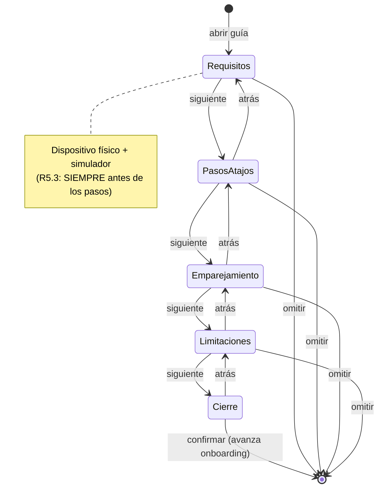
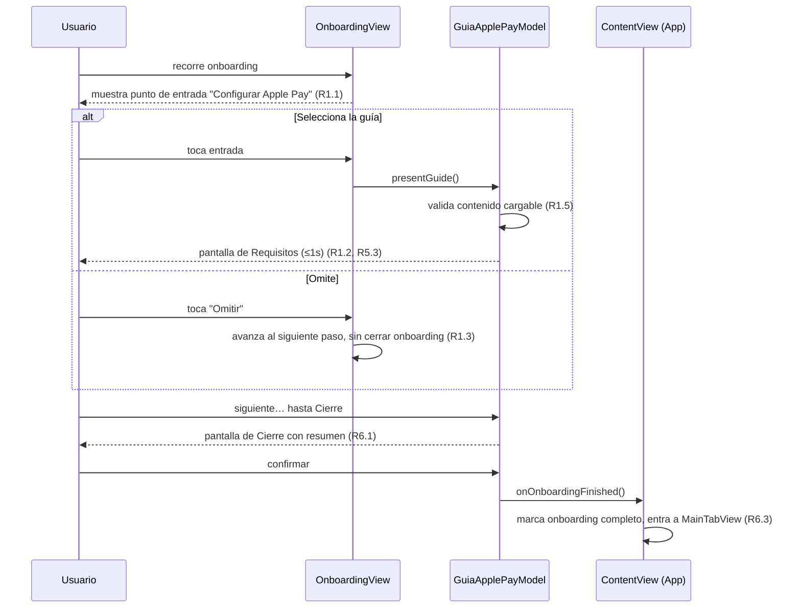

# Documento de Diseño

## Overview

La `Guia_ApplePay` es una secuencia instructiva de pantallas, dentro del onboarding de Lana, que enseña al usuario a armar por sí mismo la automatización de Atajos que alimenta la captura automática de Apple Pay (ADR-0009). El disparador "Wallet" de la app Atajos invoca el App Intent `AddTransactionIntent` ("Agregar transacción de Apple Pay"), que ya existe en el target de la app y **está fuera del alcance** de este documento. Lo mismo aplica a `Card.bestMatch(for:in:)` (`LanaCore/Models/CardMatching.swift`) y al campo `Card.walletMatchHint` (ADR-0019, ADR-0031): la guía solo los **explica y enlaza**, no los construye.

El alcance de esta funcionalidad es exclusivamente:

1. El contenido instructivo de la guía (los pasos de Atajos, el emparejamiento de tarjetas, las limitaciones conocidas y el requisito de dispositivo físico).
2. La máquina de estados de navegación de la guía (secuencia de pasos, avance/retroceso, omitir, finalización).
3. Su presentación dentro del onboarding y un punto de entrada persistente después del onboarding (en Ajustes).

La guía es puramente instructiva: **no toca datos, no crea automatizaciones, no persiste gastos**. Su única persistencia es una bandera de "onboarding completado" en `UserDefaults`, el mismo mecanismo que usa `SettingsModel` para el tema. Toda la información que muestra (pasos, mapeo de parámetros, limitaciones, texto de emparejamiento) es contenido estático definido en `LanaCore`, sin dependencia de red ni de framework de Apple.

### Decisiones de diseño clave

| Decisión | Razón | Requisitos |
|---|---|---|
| Contenido de la guía como datos puros en `LanaCore` (`Foundation` solo) | Permite probar la secuencia y la completitud del contenido sin simulador, según ARCHITECTURE.md; separa el "qué se dice" del "cómo se dibuja". | R2, R3, R4, R5 |
| Máquina de estados en un `@MainActor @Observable` modelo (`GuiaApplePayModel`), vista sin lógica | Convención MV de Lana (ARCHITECTURE.md, CONVENTIONS.md): la lógica es testeable sin XCUITest. | R1, R6 |
| Nueva feature `OnboardingFeature` que contiene el flujo de onboarding + la guía | No existe hoy onboarding de primer arranque; una feature aislada respeta "las features nunca se importan entre sí". | R1 |
| Detección de disponibilidad de Atajos/Wallet y de simulador vía un protocolo `ApplePayEnvironmentProbing` (definido en `LanaCore`, implementado en el target de la app) | Mantiene `LanaCore` en `Foundation` puro; permite fakes en previews/tests (ARCHITECTURE.md). | R2.6, R5 |
| Punto de entrada persistente en Ajustes (`SettingsView`) | Es la superficie natural de configuración post-onboarding; evita crear una nueva pestaña. | R1.4 |
| El enlace a "Ajustes → Tarjetas" y a la app Atajos se resuelven con handlers inyectados desde `ContentView` | Las features no se importan entre sí; solo `App`/`ContentView` conoce `CardsFeature` y puede abrir el formulario de tarjeta (mismo patrón que `onExpenseTap` y `openSettings` ya usados en `ContentView`). | R3.4 |

## Architecture

### Ubicación en el grafo de dependencias

La guía vive en una nueva feature, `OnboardingFeature`, con las mismas reglas que el resto (ARCHITECTURE.md): importa solo `LanaCore` y `LanaDesign`, nunca una implementación concreta ni otra feature. `ContentView` (target `App`) la ensambla y le inyecta los handlers que cruzan fronteras de feature.

```mermaid
graph TD
    App[App / ContentView] -->|arma e inyecta handlers| OF[OnboardingFeature]
    App --> SF[SettingsFeature]
    App --> CF[CardsFeature]
    OF --> Core[LanaCore]
    OF --> Design[LanaDesign]
    SF --> Core
    CF --> Core
    AppImpl[App: ApplePayEnvironmentProbe] -.implementa.-> Core

    subgraph LanaCore (Foundation puro)
      Content[GuiaApplePayContent - contenido estático]
      Probe[ApplePayEnvironmentProbing - protocolo]
    end
```

Puntos clave:

- **`LanaCore`** gana dos cosas, ambas en `Foundation` puro: la estructura de contenido estático de la guía (`GuiaApplePayContent` y sus tipos: `GuiaStep`, `ParameterMapping`, `KnownLimitation`, etc.) y el protocolo `ApplePayEnvironmentProbing` con su implementación de prueba en memoria.
- **`OnboardingFeature`** contiene `GuiaApplePayModel` (`@MainActor @Observable`), la vista `GuiaApplePayView` y sus subvistas, más el contenedor de onboarding `OnboardingModel`/`OnboardingView` que hospeda la guía como uno de sus pasos.
- **`App`** provee la implementación real de `ApplePayEnvironmentProbing` (que consulta capacidades del dispositivo/simulador), y en `ContentView` inyecta los handlers `onOpenCardSettings`, `onOpenShortcutsApp` y `onOnboardingFinished`.

### Máquina de estados de la guía

La navegación de la guía es una máquina de estados finita y determinista, guardada como un índice sobre una lista inmutable de pantallas. Esto es lo que se prueba con propiedades.



Reglas invariantes de la máquina (base de las propiedades de corrección):

1. El índice de pantalla actual siempre está en el rango `[0, screens.count)`.
2. "Requisitos de dispositivo" (simulador + hardware físico, R5) es siempre la primera pantalla, mostrada antes de cualquier paso de configuración (R5.3).
3. "Siguiente" desde la última pantalla no avanza el índice: dispara la confirmación de finalización (R6).
4. "Atrás" desde la primera pantalla no cambia el índice (no se sale de la guía por retroceder).
5. Cada avance/retroceso mueve el índice exactamente en 1.
6. La pantalla de cierre (última) enumera **todos** los pasos de configuración con su estado (R6.1).

### Flujo de presentación



### Punto de entrada persistente (post-onboarding)

Después de terminar el onboarding, la guía se re-abre desde Ajustes (R1.4). `SettingsView` gana una fila "Configurar Apple Pay" que presenta `GuiaApplePayView` como hoja. Como la guía en modo "post-onboarding" no tiene un paso de onboarding al cual avanzar, su `onFinish` simplemente cierra la hoja en lugar de llamar `onOnboardingFinished`. El modo se pasa al construir el modelo (`GuiaApplePayModel.Mode.onboarding` vs `.standalone`).

## Components and Interfaces

### LanaCore — contenido y protocolos (Foundation puro)

#### `GuiaApplePayContent`

Contenido estático de toda la guía. Es un `struct` de valores `Sendable`, construido una vez y compartido. Ningún texto de la guía vive hardcodeado en las vistas; todo sale de aquí, lo que permite probar completitud (todos los pasos requeridos presentes, mapeo completo de parámetros, todas las limitaciones) sin renderizar UI.

```swift
public struct GuiaApplePayContent: Sendable, Equatable {
    /// Requisitos de dispositivo físico y limitación del simulador (R5).
    public let deviceRequirement: DeviceRequirement
    /// Pasos numerados y ordenados para armar la automatización (R2).
    public let shortcutSteps: [GuiaStep]
    /// Mapeo de cada parámetro de Wallet al parámetro del App Intent (R2.3).
    public let parameterMappings: [ParameterMapping]
    /// Explicación de emparejamiento y su orden de prioridad (R3).
    public let matching: MatchingExplanation
    /// Limitaciones conocidas de la captura (R4).
    public let limitations: [KnownLimitation]

    /// El contenido real de producción — la única instancia que la app usa.
    public static let standard: GuiaApplePayContent
}
```

```swift
/// Un paso numerado de la secuencia de Atajos (R2.1).
public struct GuiaStep: Sendable, Equatable, Identifiable {
    public let id: Int          // orden 1-based, la "numeración" de R2.1
    public let title: String
    public let detail: String
    public let systemImage: String
}

/// El mapeo Wallet → App Intent para un parámetro (R2.3).
public struct ParameterMapping: Sendable, Equatable, Identifiable {
    public enum Parameter: String, Sendable, CaseIterable {
        case amount        // monto
        case merchant      // comercio
        case cardName      // nombre de tarjeta
    }
    public var id: Parameter { walletParameter }
    public let walletParameter: Parameter
    public let intentParameter: Parameter
    public let walletLabel: String     // como lo nombra Wallet
    public let intentLabel: String     // el título exacto del @Parameter del intent
}

/// Explicación de emparejamiento de tarjetas (R3).
public struct MatchingExplanation: Sendable, Equatable {
    /// Señales en orden de prioridad: últimos 4 dígitos primero, luego alias/hint (R3.1).
    public let prioritySignals: [MatchSignal]
    public let mismatchGuidance: String   // registrar walletMatchHint (R3.2)
    public let noMatchGuidance: String     // qué revisar si nada empareja (R3.3)
}

public struct MatchSignal: Sendable, Equatable, Identifiable {
    public let id: Int          // 0-based, define el orden de prioridad
    public let name: String
    public let explanation: String
}

/// Una limitación conocida (R4).
public struct KnownLimitation: Sendable, Equatable, Identifiable {
    public enum Kind: String, Sendable, CaseIterable {
        case nfcOnly            // solo NFC, navegador no (R4.1)
        case needsReview        // todo entra needsReview (R4.2)
        case rejectedTx         // puede registrar rechazadas (R4.3)
        case duplicateTx        // puede registrar duplicadas (R4.4)
        case reviewEach         // revisar cada transacción (R4.5)
        case manualIsPrimary    // manual sigue siendo el camino principal (R4.6)
    }
    public var id: Kind { kind }
    public let kind: Kind
    public let message: String
}

/// Requisito de dispositivo físico y limitación de simulador (R5).
public struct DeviceRequirement: Sendable, Equatable {
    public let physicalDeviceMessage: String   // requiere device físico + tarjeta en Wallet (R5.1)
    public let simulatorMessage: String         // no probable en simulador (R5.2)
}
```

#### `ApplePayEnvironmentProbing`

Protocolo que responde si el entorno actual puede siquiera armar la automatización, para R2.6 (Atajos/Wallet no disponibles) y para resaltar la limitación del simulador (R5). Vive en `LanaCore`; la implementación real la provee el target de la app (necesita APIs de UIKit/entorno), la de prueba vive junto al protocolo.

```swift
public protocol ApplePayEnvironmentProbing: Sendable {
    /// `false` cuando el disparador Wallet o la app Atajos no están
    /// disponibles en el dispositivo (R2.6).
    var isShortcutsAutomationAvailable: Bool { get }
    /// `true` cuando corre en el simulador de iOS — no se puede probar la
    /// captura ahí (R5.2).
    var isRunningInSimulator: Bool { get }
}

/// Para previews y tests — sin dependencias de sistema.
public struct InMemoryApplePayEnvironment: ApplePayEnvironmentProbing {
    public let isShortcutsAutomationAvailable: Bool
    public let isRunningInSimulator: Bool
    public init(isShortcutsAutomationAvailable: Bool = true, isRunningInSimulator: Bool = false) { ... }
}
```

### OnboardingFeature — modelo y vistas

#### `GuiaApplePayModel` (`@MainActor @Observable`)

Toda la lógica de navegación y estado de la guía. La vista no decide nada (CONVENTIONS.md).

```swift
@MainActor
@Observable
public final class GuiaApplePayModel {
    public enum Mode: Sendable {
        case onboarding   // termina avanzando el onboarding
        case standalone   // termina cerrando la hoja (post-onboarding, R1.4)
    }

    /// Las pantallas de la guía, en orden. Inmutable tras construir.
    public enum Screen: Int, CaseIterable, Sendable {
        case requirements   // R5 — SIEMPRE primero (R5.3)
        case shortcutSteps  // R2
        case matching       // R3
        case limitations    // R4
        case closing        // R6
    }

    public private(set) var currentScreen: Screen
    public private(set) var content: GuiaApplePayContent?   // nil si falló cargar (R1.5)
    public private(set) var presentationError: String?      // R1.5
    public private(set) var summaryUnavailable: Bool        // R6.2
    public private(set) var advanceError: String?           // R6.4
    public private(set) var isFinished: Bool

    /// Estado del entorno para R2.6 / R5.
    public var isAutomationAvailable: Bool
    public var isRunningInSimulator: Bool

    public init(mode: Mode,
                content: GuiaApplePayContent? = .standard,
                environment: any ApplePayEnvironmentProbing)

    // Navegación (máquina de estados)
    public func presentFirstScreen()   // R1.2 / R1.5
    public func next()                 // avanza índice o dispara cierre/confirmación
    public func back()                 // retrocede índice, no-op en la primera
    public func skip()                 // R1.3 — marca omitido sin cerrar onboarding
    public func confirmCompletion()    // R6.3 / R6.4 — pide avanzar onboarding
    public func retryPresentation()    // R1.5
    public func retryAdvance()         // R6.4

    /// Resumen de pasos completados para la pantalla de cierre (R6.1).
    public var completionSummary: [CompletionStep] { get }
}

public struct CompletionStep: Sendable, Equatable, Identifiable {
    public let id: Int
    public let title: String
    public let isCompleted: Bool
}
```

Notas de comportamiento mapeadas a requisitos:

- `presentFirstScreen()`: si `content == nil`, fija `presentationError` y **no** cambia de pantalla (R1.5); si hay contenido, fija `currentScreen = .requirements` (R5.3) — el llamador (onboarding) mide el ≤1s (R1.2).
- `next()`/`back()`: mueven `currentScreen` por su `rawValue`, respetando límites (invariantes 1, 3, 4, 5). En `.closing`, `next()` no aplica; el control activo es "confirmar".
- `skip()`: fija `isFinished = true` con una razón "omitido"; la guía no activa captura ni cierra el onboarding — eso lo maneja el contenedor `OnboardingModel` avanzando de paso (R1.3).
- `confirmCompletion()`: en `Mode.onboarding` invoca el handler `onOnboardingFinished`; si ese avance falla, el contenedor fija `advanceError` y conserva el resumen (R6.4). En `Mode.standalone`, cierra la hoja.
- `completionSummary`: deriva de `content.shortcutSteps`; si `content == nil` al llegar a cierre, `summaryUnavailable = true` y el control de confirmar sigue disponible (R6.2).

#### `OnboardingModel` / `OnboardingView`

Contenedor del onboarding. Presenta sus propios pasos (bienvenida, etc.) y en al menos uno de ellos incluye el punto de entrada visible y etiquetado a la guía (R1.1). Maneja "omitir" avanzando su propio paso sin cerrar el flujo (R1.3) y expone `onOnboardingFinished` hacia `ContentView`.

> Nota de alcance: el onboarding general de Lana no existe hoy. Este diseño introduce el contenedor mínimo necesario para hospedar la guía y su punto de entrada; los demás pasos de onboarding (si los hubiera) quedan como un arreglo de pasos extensible, pero su contenido no es parte de esta funcionalidad.

#### Vistas

- `GuiaApplePayView`: hospeda la pantalla actual según `model.currentScreen`, con botones "Atrás"/"Siguiente"/"Omitir" y, en cierre, "Confirmar". Sin lógica: refleja el modelo. Un `#Preview` por los temas (CONVENTIONS.md).
- Subvistas privadas en `Components/`: `RequirementsStepView` (R5), `ShortcutStepsView` (R2, lista numerada + mapeo de parámetros), `MatchingStepView` (R3, con botón "Abrir Ajustes → Tarjetas" que llama el handler inyectado, R3.4), `LimitationsStepView` (R4), `ClosingStepView` (R6, resumen con indicadores de estado).
- Estados de error como `EmptyStateView` de `LanaDesign` (patrón de `AvailabilityOnboardingView`): error de presentación con "Reintentar" (R1.5), Atajos no disponible (R2.6), resumen no disponible (R6.2), avance fallido con "Reintentar" (R6.4). El color nunca es único portador de información: los indicadores de estado combinan ícono + texto (CONVENTIONS.md).

### App / ContentView — ensamblaje

`ContentView` (o un `RootView` equivalente) decide si mostrar onboarding o `MainTabView` según la bandera `hasCompletedOnboarding` en `UserDefaults`. Inyecta:

- `ApplePayEnvironmentProbe` real (implementación de `ApplePayEnvironmentProbing`).
- `onOpenCardSettings`: abre el formulario/pantalla de tarjetas de `CardsFeature` (R3.4) — mismo patrón que `onExpenseTap` ya existente.
- `onOpenShortcutsApp`: abre la app Atajos vía URL scheme (best-effort; su ausencia no rompe la guía).
- `onOnboardingFinished`: fija `hasCompletedOnboarding = true` y transiciona a `MainTabView` (R6.3), reportando fallo al modelo si no puede (R6.4).

`SettingsView`/`SettingsModel` ganan la fila "Configurar Apple Pay" que presenta la guía en `Mode.standalone` (R1.4).

## Data Models

Esta funcionalidad es casi enteramente instructiva; no introduce entidades de dominio nuevas ni toca Core Data. Los únicos "datos" son:

1. **Contenido estático** (`GuiaApplePayContent` y tipos anidados, arriba): estructuras de valor inmutables en `LanaCore`, construidas en código como constante `.standard`. No se persisten ni sincronizan.

2. **Estado de navegación** (en `GuiaApplePayModel`): `currentScreen: Screen` (índice de máquina de estados) más banderas de error/finalización. Vive solo en memoria mientras la guía está presentada.

3. **Bandera de onboarding completado**: un `Bool` en `UserDefaults` (`"lana.hasCompletedOnboarding"`), mismo mecanismo que `SettingsModel` usa para el tema. Es la única escritura persistente de toda la funcionalidad.

No hay modelos de Core Data, ni eventos de ledger, ni cambios al esquema. La guía **lee** conceptualmente sobre `Card.walletMatchHint` y `Card.bestMatch` para explicarlos, pero no los invoca ni los modifica.

## Correctness Properties

*Una propiedad es una característica o comportamiento que debe cumplirse en todas las ejecuciones válidas de un sistema — esencialmente, una afirmación formal sobre lo que el sistema debe hacer. Las propiedades son el puente entre la especificación legible por humanos y las garantías de corrección verificables por máquina.*

Esta funcionalidad es mayormente instructiva y de UI, donde el testing por propiedades no aplica a la mayoría de los criterios (presencia de textos, latencias, rendering — ver Testing Strategy). Sin embargo, dos superficies sí tienen invariantes universales y valen una prueba por propiedades: (1) la **estructura del contenido estático** de la guía (numeración, cobertura, orden de prioridad) y (2) la **máquina de estados de navegación** de `GuiaApplePayModel`. Las propiedades siguientes se limitan a esas dos superficies.

### Property 1: Invariantes de la máquina de estados de navegación

*Para toda* secuencia finita de acciones `next`/`back` aplicadas a `GuiaApplePayModel` partiendo de `presentFirstScreen()` (con contenido válido), el `currentScreen.rawValue` se mantiene siempre dentro de `[0, Screen.allCases.count)`; la pantalla inicial es siempre `.requirements`; cada `next`/`back` mueve el índice a lo más en 1 (o lo deja igual en los extremos); y `Screen.requirements.rawValue < Screen.shortcutSteps.rawValue` (los requisitos de dispositivo y la limitación de simulador se presentan antes que los pasos de configuración).

**Validates: Requirements 1.2, 5.3, 6.1**

### Property 2: Los pasos de Atajos están numerados de forma consecutiva y ordenada

*Para toda* la secuencia `GuiaApplePayContent.standard.shortcutSteps`, los identificadores `GuiaStep.id` forman una secuencia estrictamente creciente, sin huecos ni duplicados, empezando en 1 (`ids == [1, 2, ..., n]`), y el conjunto cubre los pasos mínimos requeridos (abrir Atajos, crear automatización, seleccionar disparador Wallet, agregar la acción del App Intent, guardar).

**Validates: Requirements 2.1**

### Property 3: El mapeo de parámetros es una biyección total sobre los tres parámetros

*Para todo* valor de `ParameterMapping.Parameter` en `{amount, merchant, cardName}`, `GuiaApplePayContent.standard.parameterMappings` contiene exactamente un mapeo cuyo `walletParameter` es ese valor, y en ese mapeo `intentParameter == walletParameter` (monto→monto, comercio→comercio, nombre de tarjeta→nombre de tarjeta), sin parámetros faltantes ni duplicados.

**Validates: Requirements 2.3**

### Property 4: Las señales de emparejamiento están ordenadas por prioridad, con últimos-4-dígitos primero

*Para toda* la secuencia `MatchingExplanation.prioritySignals`, los `MatchSignal.id` son consecutivos desde 0, estrictamente crecientes y sin duplicados, y la señal de mayor prioridad (índice 0) corresponde a los últimos 4 dígitos, seguida por el alias / nombre en Wallet.

**Validates: Requirements 3.1**

### Property 5: Cobertura total de las limitaciones conocidas

*Para todo* caso de `KnownLimitation.Kind` (los seis: `nfcOnly`, `needsReview`, `rejectedTx`, `duplicateTx`, `reviewEach`, `manualIsPrimary`), `GuiaApplePayContent.standard.limitations` contiene exactamente una entrada con ese `kind` y con `message` no vacío, sin duplicados.

**Validates: Requirements 4.1, 4.2, 4.3, 4.4, 4.5, 4.6**

### Property 6: El resumen de cierre corresponde 1:1 con los pasos de configuración

*Para todo* contenido de guía válido, `completionSummary` tiene exactamente un `CompletionStep` por cada `GuiaStep` de `shortcutSteps`, en el mismo orden, preservando el título de cada paso (`completionSummary.count == shortcutSteps.count` y correspondencia por índice).

**Validates: Requirements 6.1**

## Error Handling

Un enum de error por módulo, conformando `LocalizedError`, con mensajes en español y acción clara (CONVENTIONS.md). La guía no persiste datos, así que sus "errores" son estados de UI recuperables, no fallos de dominio.

| Condición | Detección | Manejo | Requisito |
|---|---|---|---|
| No se puede mostrar la primera pantalla | `content == nil` en `presentFirstScreen()` | Fija `presentationError`; no cambia de pantalla; el onboarding se mantiene en su paso actual; se ofrece "Reintentar" (`retryPresentation()`). | R1.5 |
| Atajos / disparador Wallet no disponibles | `environment.isShortcutsAutomationAvailable == false` | En la pantalla de pasos se muestra un `EmptyStateView` explicando la incompatibilidad y la condición requerida; no se ofrece armar la automatización. | R2.6 |
| Simulador | `environment.isRunningInSimulator == true` | Se resalta la limitación de simulador en la pantalla de requisitos (siempre visible por R5.3). | R5.2, R5.3 |
| Resumen de cierre no disponible | `content == nil` al llegar a `.closing` | `summaryUnavailable = true`; se muestra mensaje "el resumen no pudo cargarse" y **se conserva** el control de confirmar. | R6.2 |
| El avance del onboarding falla tras confirmar | El handler `onOnboardingFinished` reporta fallo | `advanceError` se fija; `currentScreen` permanece `.closing`; el resumen (`completionSummary`) se conserva para `retryAdvance()`. | R6.4 |

```swift
public enum GuiaApplePayError: LocalizedError {
    case contentUnavailable          // R1.5 / R6.2
    case automationUnsupported       // R2.6
    case onboardingAdvanceFailed     // R6.4

    public var errorDescription: String? {
        switch self {
        case .contentUnavailable:
            "No se pudo cargar la guía. Intenta de nuevo."
        case .automationUnsupported:
            "Este dispositivo no puede crear la automatización: falta la app Atajos o el disparador de Wallet."
        case .onboardingAdvanceFailed:
            "No se pudo continuar. Intenta de nuevo."
        }
    }
}
```

Ningún error usa `fatalError` ni `NSError` genérico. Los indicadores de estado en la pantalla de cierre combinan ícono + texto (nunca solo color — CONVENTIONS.md).

## Testing Strategy

### Enfoque

Testing dual, con Swift Testing (no XCTest), probando el **modelo** y el **contenido**, nunca la vista (ARCHITECTURE.md, CONVENTIONS.md). Como la mayor parte de esta funcionalidad es UI e instructiva, el grueso de la cobertura son tests de ejemplo y edge cases; solo las seis invariantes estructurales y de navegación arriba justifican pruebas por propiedades.

**Por qué PBT aplica solo parcialmente:** casi todos los criterios son presencia de texto (R2.2, R2.4, R2.5, R3.2, R3.3, R5.1, R5.2), invocación de handlers (R3.4, R6.3), latencias (R1.2 ≤1s, R6.1/R6.3 ≤2s) o rendering de un control (R1.1, R1.4) — para todos ellos "para todo input X, P(X)" no aporta sobre un ejemplo. Las excepciones son las invariantes de la secuencia de contenido y de la máquina de estados, donde sí existe un espacio de entrada (secuencias de navegación) o una cuantificación universal real sobre colecciones/enums.

### Property tests

- Librería: **swift-testing** con generación de entradas mediante `arguments:` (parametrizados) para las propiedades de contenido, y para la máquina de estados un generador de secuencias aleatorias de acciones `next`/`back` (mínimo 100 secuencias por corrida).
- Cada test de propiedad se etiqueta con un comentario que referencia la propiedad del diseño. Formato: **Feature: apple-pay-setup-guide, Property {número}: {texto de la propiedad}**.
- Cada propiedad se implementa con un **único** test de propiedad, con **mínimo 100 iteraciones**.

Cobertura de propiedades:

| Propiedad | Qué se genera | Qué se verifica |
|---|---|---|
| 1 | Secuencias aleatorias de `next`/`back` (≥100) sobre el modelo | Índice en rango, inicio en `.requirements`, movimientos ±1, `requirements < shortcutSteps` |
| 2 | (universal sobre `shortcutSteps`) | Ids `[1..n]` consecutivos y ordenados; pasos mínimos cubiertos |
| 3 | Cada caso de `Parameter` (≥100 iteraciones sobre los casos) | Exactamente un mapeo por parámetro, `intentParameter == walletParameter` |
| 4 | (universal sobre `prioritySignals`) | Ids `[0..m]` ordenados; índice 0 == últimos 4 dígitos |
| 5 | Cada caso de `KnownLimitation.Kind` | Exactamente una entrada por kind, `message` no vacío |
| 6 | Contenidos válidos (incluye variaciones de longitud de `shortcutSteps`) | `completionSummary` 1:1 con `shortcutSteps`, mismo orden y títulos |

### Unit tests (ejemplos y edge cases)

- **Presencia de contenido (R2.2, R2.4, R2.5, R3.2, R3.3, R5.1, R5.2):** ejemplos que verifican strings clave — título exacto "Agregar transacción de Apple Pay", instrucción de una automatización por tarjeta, ejecución sin confirmación, guía de `walletMatchHint`, guía de no-match (alias/NombreEnWallet/últimos 4), mensajes de dispositivo físico y simulador no vacíos.
- **Entrada y presentación (R1.2, R1.3):** `presentFirstScreen()` con contenido válido deja `currentScreen == .requirements`; `skip()` fija `isFinished` sin invocar avance ni captura.
- **Handlers (R3.4, R6.3):** con un espía (fake) del handler, "abrir Ajustes → Tarjetas" invoca `onOpenCardSettings` una vez; `confirmCompletion()` en `Mode.onboarding` invoca `onOnboardingFinished` una vez.
- **Edge cases de error (R1.5, R2.6, R6.2, R6.4):** con `content == nil`, `presentFirstScreen()` fija `presentationError` y no cambia pantalla, y `retryPresentation()` reintenta; con `isShortcutsAutomationAvailable == false`, el modelo expone el estado de incompatibilidad; con `content == nil` en cierre, `summaryUnavailable == true` con confirmar disponible; con avance fallido, `advanceError` fijo, `currentScreen == .closing`, resumen conservado.
- **Presencia de puntos de entrada (R1.1, R1.4):** `OnboardingModel` incluye el punto de entrada de la guía; `SettingsModel`/`SettingsView` incluye la fila para reabrirla en `Mode.standalone`.

### Fuera de alcance de tests automatizados

- **Latencias (R1.2 ≤1s, R6.1/R6.3 ≤2s):** verificación manual/perf en dispositivo; no son deterministas en pruebas unitarias.
- **`AddTransactionIntent`, `Card.bestMatch`, `walletMatchHint`:** ya existen y están fuera de alcance; sus tests viven en `CardMatchingTests` (ADR-0019). El intent en sí no es testeable con Swift Testing (requiere runtime de AppIntents — prueba manual, PLAN.md).
- **La implementación real de `ApplePayEnvironmentProbing`:** consulta el entorno del sistema; se prueba con `InMemoryApplePayEnvironment` en el modelo, y su versión real se valida manualmente en dispositivo/simulador.

### Previews

Toda vista pública lleva `#Preview` que itera los temas de `LanaTheme.allCases` usando `AppDependencies.preview()` y `InMemoryApplePayEnvironment`, cubriendo estados normales y de error (CONVENTIONS.md).
